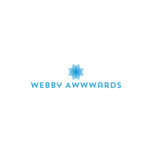

<p align="center">
    <!-- Put your logo over here -->
    
  </a>
  <h3 align="center">Awards</h3>
  <p align="center">
    Awards is an application built upon the django framework that also has incorporated the django rest-framwork. This app is supposed to resemble the awwwards website.
    <br />
    <a href="https://github.com/mibei001/Awards"><strong>Explore the docs »</strong></a>
    <br />
    <br />
  </p>
</p>

<!-- TABLE OF CONTENTS -->
<details open="open">
  <summary><h2 style="display: inline-block">Table of Contents</h2></summary>
  <ol>
    <li>
      <a href="#about-the-project">About The Project</a>
      <ul>
        <li><a href="#built-with">Built With</a></li>
      </ul>
    </li>
    <li>
      <a href="#getting-started">Getting Started</a>
      <ul>
        <li><a href="#prerequisites">Prerequisites</a></li>
        <li><a href="#installation">Installation</a></li>
      </ul>
    </li>
    <li><a href="#usage">Usage</a></li>
    <li><a href="#roadmap">Roadmap</a></li>
    <li><a href="#contributing">Contributing</a></li>
    <li><a href="#license">License</a></li>
    <li><a href="#contact">Contact</a></li>
    <li><a href="#acknowledgements">Acknowledgements</a></li>
  </ol>
</details>

## About The Project

`Webby-Awards`, `twitter_handle`, `kevin.mibei@student.moringaschool.com`, `Awards`, `Awards application is meant to be a clone of the Awwwards website.`

### Built With

- [Django](https://docs.djangoproject.com/en/3.2/)
- [HTML](https://html.com)
- [CSS](https://developer.mozilla.org/en-US/docs/Web/CSS)
- [BOOTSTRAP](https://getbootstrap.com)

<!-- GETTING STARTED -->

## Getting Started

To get a local copy up and running follow these simple steps.

### Installation

1. Clone the repo
   ```sh
   git clone https://github.com/mibei001/Awards.git
   ```
2. Install all dependecies
   ```sh
   pip install -r ./requirements.txt
   ```
3. Run the Application
   ```sh
   pyhton manage.py runserver
   ```

<!-- USAGE EXAMPLES -->

## Usage

<!-- Put GIF here bro! -->

You could see the various posts other have posted in the application and it basically looks like Instagram app.

_For more examples, please refer to the [Documentation](https://example.com)_

<!-- CONTRIBUTING -->

## Contributing

Contributions are what make the open source community such an amazing place to learn, inspire, and create. Any contributions you make are **greatly appreciated**.

1. Fork the Project
2. Create your Feature Branch (`git checkout -b feature/AmazingFeature`)
3. Commit your Changes (`git commit -m 'Add some AmazingFeature'`)
4. Push to the Branch (`git push origin feature/AmazingFeature`)
5. Open a Pull Request

<!-- LICENSE -->

## License

Distributed under the MIT License. See `LICENSE` for more information.

<!-- CONTACT -->

## Contact

kevin mibei - kevinmibei@student.moringaschool.com

Project Link: [https://github.com/mibei001/Awards](https://github.com/mibei001/Awards)

<!-- ACKNOWLEDGEMENTS -->

## Acknowledgements

- [Bootstrap](https://getbootstrap.com)
- [Font Awesome](https://fontawesome.com)
- [Google Fonts](https://fonts.google.com)
- [License](https://choosealicense.com)
